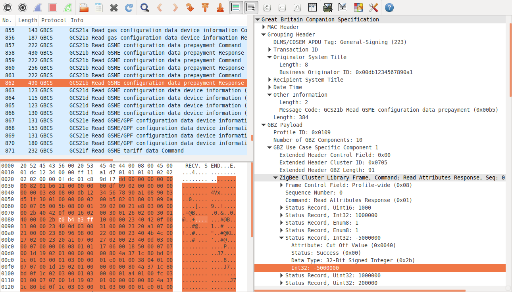

# wireshark-gbcs

Great Britain Companion Specification (GBCS) dissector plugin for Wireshark.
Dissects the GBCS messages (which are specialisations of the DLMS General-Ciphering and General-Signing APDUs) in UDP datagrams on the default DLMS port 4059 (which can be changed in the Analyze -> Decode As... menu) or in raw data handed off by custom dissectors.
Requires the [wireshark-dlms](https://github.com/andrebdo/wireshark-dlms) plugin to dissect the DLMS payloads.

## Install

### GNU/Linux

1. Install the Wireshark development libraries: sudo apt-get install wireshark-dev
2. Compile the gbcs.so plugin: sh build.sh
3. Copy the gbcs.so plugin to the Wireshark plugins directory: sudo cp gbcs.so /usr/lib/x86_64-linux-gnu/wireshark/plugins/2.4.5/gbcs.so

### Windows

Copy the pre-compiled gbcs.dll plugin file to your Wireshark plugins directory (usually C:\Program Files\Wireshark\plugins\2.6\epan\gbcs.dll).

To compile the gbcs.dll plugin yourself:
1. Compile the Wireshark source code for Windows, as described in https://www.wireshark.org/docs/wsdg_html_chunked/ChSetupWin32.html
2. Edit the build.bat file and adjust the directory paths as necessary
3. Run build.bat

## License

These files are distributed under the same license as Wireshark (the GNU General Public License version 2).
